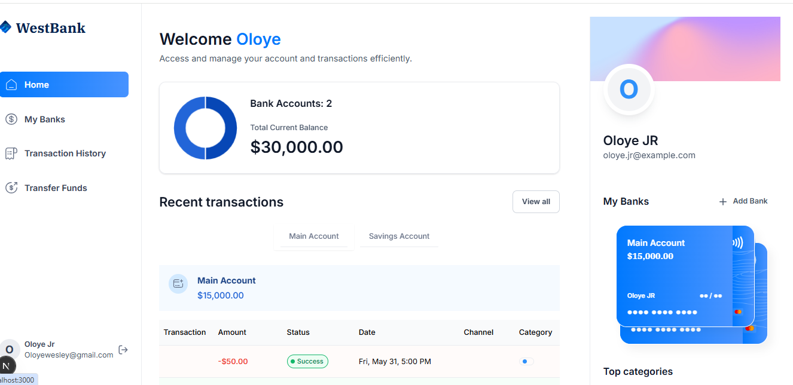
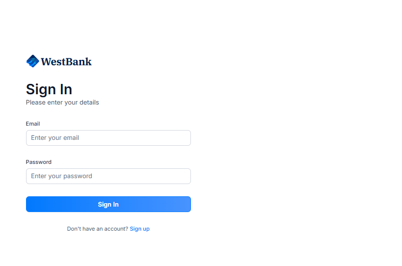
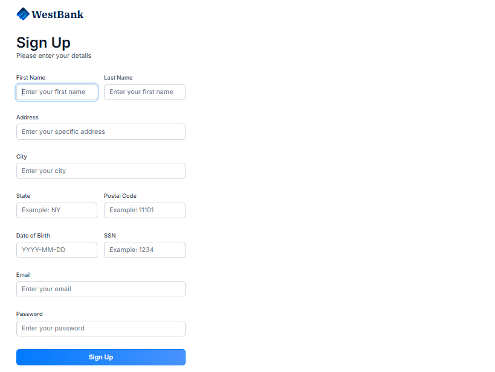
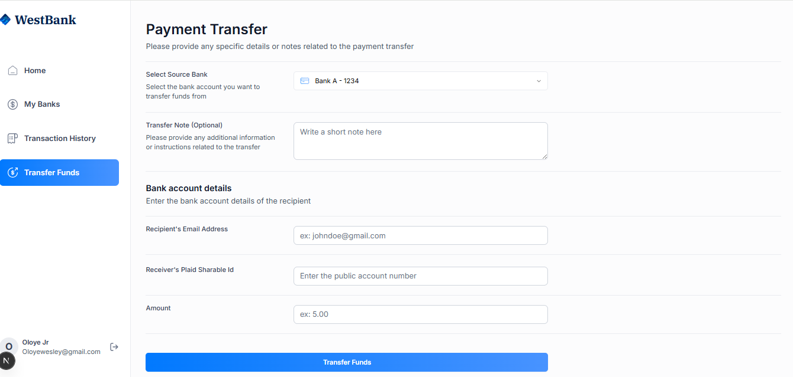
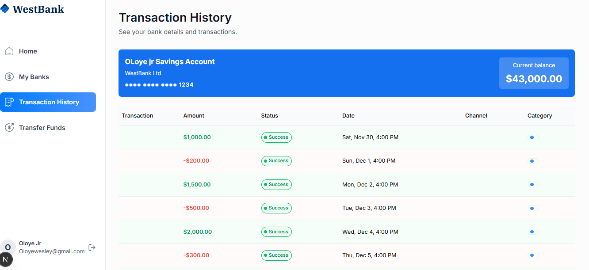

# 💳 Banking Web App with Next.js & TypeScript

> **A modern digital banking experience built with Next.js, TypeScript, Appwrite, and Plaid.**  
> Designed for secure account management, real-time transactions, and smooth money transfers — all wrapped in a sleek, responsive UI.

---

## 🚀 Overview

This project is a **full-stack digital banking web application** that enables users to securely manage multiple bank accounts, view detailed transaction histories, and make instant transfers between accounts.

It was built to demonstrate **frontend excellence**, **API integration**, and **modern UI/UX principles** using **Next.js**, **TypeScript**, and **TailwindCSS**.

---

## 🖼️ Screenshots

### 🏠 Dashboard  


### 🔐 Sign In  


### 📝 Sign Up  


### 💸 Transfer Funds  


### 📊 Transaction History  


---

## 🧩 Key Features

✅ **Authentication System** — Secure login & registration powered by Appwrite Auth.  
✅ **Bank Integration via Plaid** — Connect real bank accounts and fetch balances safely.  
✅ **Account Dashboard** — View total balance, individual accounts, and spending insights.  
✅ **Transaction Management** — Filter and browse detailed transaction history.  
✅ **Funds Transfer** — Send money between linked accounts seamlessly.  
✅ **Data Visualization** — Real-time analytics via interactive charts (Chart.js).  
✅ **Responsive Design** — Optimized for desktop and mobile using TailwindCSS.  
✅ **Reusable Components** — Clean modular structure with reusable UI primitives.

---

## 🧠 Tech Stack

| Category | Technology |
|-----------|-------------|
| **Frontend Framework** | [Next.js 14](https://nextjs.org/) |
| **Language** | [TypeScript](https://www.typescriptlang.org/) |
| **UI Styling** | [TailwindCSS](https://tailwindcss.com/) + [ShadCN/UI](https://ui.shadcn.com/) |
| **State Management** | React Hooks + Context |
| **Backend Services** | [Appwrite](https://appwrite.io/) |
| **Bank API Integration** | [Plaid](https://plaid.com/) |
| **Charts** | [Chart.js](https://www.chartjs.org/) + [React Chart.js 2](https://react-chartjs-2.js.org/) |
| **Form Handling** | [React Hook Form](https://react-hook-form.com/) |
| **Icons** | [Lucide React](https://lucide.dev/) |

---

## 📁 Project Structure

Banking-web-app-with-nextjs-typescript/
├── app/
│ ├── (auth)/ # Authentication pages (sign-in, sign-up)
│ ├── (root)/ # Main app routes
│ ├── globals.css # Global styles
│ └── layout.tsx # Root layout
├── components/
│ ├── ui/ # ShadCN-based reusable UI components
│ ├── AuthForm.tsx
│ ├── BankDropdown.tsx
│ ├── BankCard.tsx
│ ├── PaymentTransferForm.tsx
│ ├── Sidebar.tsx
│ ├── RightSidebar.tsx
│ ├── Footer.tsx
│ └── ...
├── constants/
│ └── index.ts # App constants and configs
├── lib/
│ ├── actions/ # Server actions & API calls
│ └── utils.ts # Utility functions
├── public/
│ ├── icons/
│ └── screenshots/ # App screenshots
├── types/
│ └── index.d.ts # Global type definitions
├── tailwind.config.ts
├── tsconfig.json
└── package.json

yaml
Copy code

---

## ⚙️ Installation & Setup

### 1️⃣ Clone the Repository
```bash
git clone https://github.com/Oloyejr17/Banking-web-app-with-nextjs-typescript.git
cd Banking-web-app-with-nextjs-typescript
2️⃣ Install Dependencies
bash
Copy code
npm install
3️⃣ Set Up Environment Variables
Create a .env.local file in the root directory and add:

bash
Copy code
NEXT_PUBLIC_APPWRITE_ENDPOINT=your_appwrite_endpoint
NEXT_PUBLIC_APPWRITE_PROJECT_ID=your_project_id
NEXT_PUBLIC_PLAID_CLIENT_ID=your_plaid_client_id
NEXT_PUBLIC_PLAID_SECRET=your_plaid_secret
NEXT_PUBLIC_PLAID_ENV=sandbox
4️⃣ Run the Development Server
bash
Copy code
npm run dev
Then open http://localhost:3000 in your browser.

🧰 Scripts
Command	Description
npm run dev --	Start the development server
npm run build	-- Build for production
npm run start	-- Run production build
npm run lint	-- Check code style and lint issues

🧑🏽‍💻 Developer
👤 Azubike Oloye
Frontend Developer

## 👨🏽‍💻 Portfolio

🌐 **Portfolio** — [View my personal site](https://portfolio-website-wzut.vercel.app/)


🏁 Future Improvements
🔐 Add two-factor authentication (2FA)

📱 Launch a Flutter mobile version

💬 Integrate notifications & in-app chat

🌍 Multi-currency support

🪪 License
This project is licensed under the MIT License — feel free to use and modify for your own learning or portfolio projects.

⭐ If you like this project...
Support by giving the repo a star on GitHub — it really helps!

yaml
Copy code
